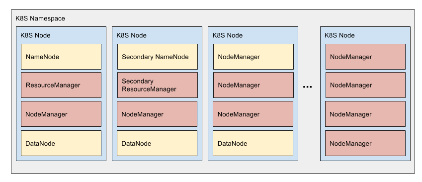

# YARN on Kubernetes



#### [Initial Design Document (Google Docs)](https://docs.google.com/document/d/1ZoKLWkHiZZPP-394aUTIOE9R7Vx88pgOC8NE0hkVn24/edit?usp=sharing)

## PetSet Overview

The hadoop components are boostrapped using files from a `ConfigMap` to provide the init script and config xml files. This allows users to fully customize their distribution for their use cases.

The `ACP` env var can also be set to a comma-separated list of URLs to be downloaded and added to the classpath at runtime.

Logs from the `${HADOOP_PREFIX}/logs` directory are tailed so that they can be viewed by attaching to the container.

### `hdfs-nn` - HDFS Name Node

The namenode daemon runs in this pod container.

Currently, only 1 namenode is supported (no HA w/Zookeeper or secondary namenode).

### `hdfs-dn` - HDFS Data Node

The datanode daemon runs in this pod container.

There can be 1 or more of these, scaled by changing the number of `replicas` in the spec.

### `yarn-rm` - YARN Resource Manager

The resource manager daemon runs in this pod container.

Currently, only 1 resource manager is supported (no HA w/Zookeeper).

The WebUI can be accessed using the service port `8088` or at `localhost:8088` after running `make pf`.

### `yarn-nm` - YARN Node Manager

The node manager daemon runs in this pod container.

There can be 1 or more of these, scaled by changing the number of `replicas` in the pod spec.

The amount of vcores and memory registered with the resource manager is reflected and infered from the pod spec resources using the [`Downward API`](http://kubernetes.io/docs/user-guide/downward-api/). These are made available to the container via the env vars `MY_CPU_LIMIT` and `MY_MEM_LIMIT` respectively and then added to the `yarn-site.xml` at runtime using the bootstrap script.

### `zeppelin` - Zeppelin Notebook

The Zeppelin notebook is run in this pod container and can be used to run Spark jobs or hadoop jobs using the `%sh` shell interpreter.

The K8S yarn cluster config is mounted from the same `ConfigMap` over the top of the Zeppelin image dir to give it access to the cluster without modifying the base image.

The Zeppelin web app can be accessed using the service port `8080` or at `localhost:8081` after running `make pf`.

## Running locally

This repo uses [`minikube`](https://github.com/kubernetes/minikube) to start a k8s cluster locally.

The [`Makefile`](./Makefile) contains targets for starting the cluster and helper targets for `kubectl` to apply the K8S manifests and interact with the pods.

When running locally with minikube, make sure your VM has enough resources, you should set the number of cpus to 8 and memory to 8192. If not set, the pods won't have enough resources to fully start and will be stuck in the `Pending` creation phase.

Starting minikube manually:

```
minikube start --cpus 8 --memory 8192
```

Or, start with the Makefile which will download minikube and start the cluster:

```
make minikube
```

## Start the YARN cluster:

```
make
```

This will create all of the components for the cluster.

Run this to create port forwards to `localhost`:

```
make pf
```

You should now be able to access the following:

- YARN WebUI: `http://localhost:8088`
- Zeppelin: `http://localhost:8081`

### Full stack test

Test hdfs, yarn and mapred using `TestDFSIO`, submitted from one of the node managers:

```
make test
```

Which runs this command on `yarn-nm-0`:

```
/usr/local/hadoop/bin/hadoop jar /usr/local/hadoop/share/hadoop/mapreduce/hadoop-mapreduce-client-jobclient-2.6.0-tests.jar TestDFSIO -write -nrFiles 5 -fileSize 128MB -resFile /tmp/TestDFSIOwrite.txt
```

### Spark on YARN in Zeppelin

In your browser, go to Zeppelin at: http://localhost:8081

Create a new note and run this in a paragraph:

```
sc.parallelize(1 to 1000).count
```

Press `shift-enter` to execute the paragraph

The first command executed creates the spark job on yarn and will take a few seconds, then you should get the result `1000` when complete.

## Custom image

If you want to compile additional native libraries, like [Protobuf](https://wiki.apache.org/hadoop/ProtocolBuffers), you can do so with the build targets in the [`image`](./image) directory.

This `Makefile` will compile the hadoop native libraries and build the latest hadoop `2.6` and `2.7` docker images for use with the Kubernetes manifests.

> Note that there isn't anything really unique about the docker image, as the K8S ConfigMap does most of the boostraping and is designed to work with generic hadoop docker images.

This will build the hadoop 2.6 and 2.7 images with the natice libraries. You can push these to your own registry and update the manifests files to run your custom image.

```
cd image && make
```

## Make targets:

### `init`

Create the namespace, configmaps service account and hosts-disco service.

### `create-apps`

Creates hdfs, yarn and zeppelin apps.

### `pf`

Creates local port forwards for yarn and zeppelin.

### `dfsreport`

Gets the state of HDFS.

### `get-yarn-nodes`

Lists the registered yarn nodes by executing this in the node manager pod: `yarn node -list`

### `shell-hdfs-nn-0`

Drops into a shell on the namenode

### `shell-yarn-rm-0`

Drops into a shell on the resource manager.

### `shell-zeppelin-0`

Drops into a shell on the zeppelin container.

## Shutting down

```
make clean
```

Shutdown the cluster

```
minikube stop
```

Or:

```
make stop-minikube
```
